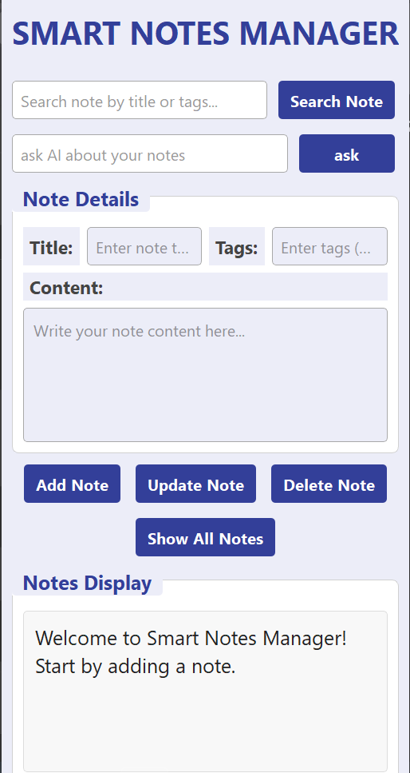

# Smart Notes AI

Smart Notes AI is an intelligent desktop note-taking application that combines a traditional notes manager with Local AI using Retrieval-Augmented Generation (RAG).

Instead of asking a general-purpose AI, the assistant answers questions **only from your personal notes**.

The application runs completely locally using Ollama, making it private, fast, and free.

---

## Features

- Create notes
- Update notes
- Delete notes
- Search notes
- Organize notes using tags
- Local SQLite database
- Semantic Search using Embeddings
- RAG (Retrieval-Augmented Generation)
- Local LLM powered by Ollama
- Responsive GUI using QThread
- Modern PyQt5 interface

---

## Technologies

- Python 3
- PyQt5
- SQLite
- NumPy
- Ollama
- nomic-embed-text
- Qwen2.5
- Retrieval-Augmented Generation (RAG)

---

## How It Works

1. Every note is stored inside SQLite.
2. An embedding is generated using **nomic-embed-text**.
3. Embeddings are saved inside the database.
4. When the user asks a question:
   - A query embedding is generated.
   - Cosine Similarity is computed.
   - The most relevant notes are retrieved.
   - Retrieved notes are injected into the LLM prompt.
5. The answer is generated only from your own notes.

---

## AI Models

Embedding Model

```
nomic-embed-text
```

Language Model

```
qwen2.5:3b
```

---

## Requirements

- Python 3.11+
- Ollama

Install Ollama:

https://ollama.com

Download the required models:

```bash
ollama pull qwen2.5:3b

ollama pull nomic-embed-text
```

---

## Installation

Clone the repository

```bash
git clone https://github.com/YOUR_USERNAME/smart-notes-ai.git

cd smart-notes-ai
```

Install packages

```bash
pip install -r requirements.txt
```

Run

```bash
python main.py
```

---

## Screenshots

## Main Window



### AI Assistant

(Add Screenshot Here)

---

## Future Improvements

- Vector Database (FAISS)
- Dark Mode
- Export Notes
- PDF Support
- Markdown Support
- Multi-threaded Embedding Generation
- Better UI Animations

---

## License

MIT License

